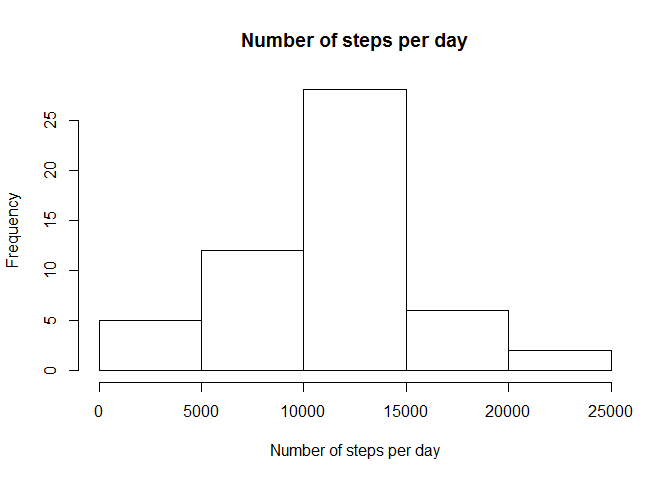
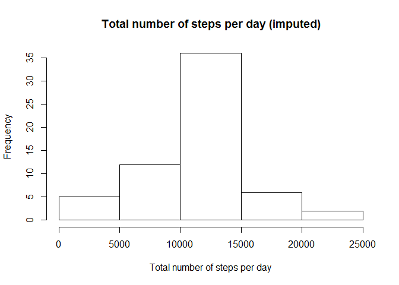
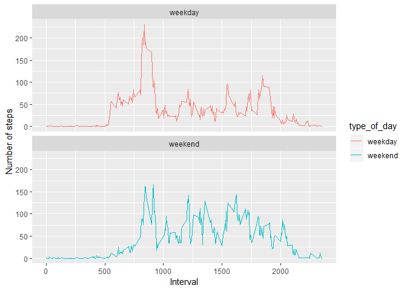

## Loading and preprocessing the data
Under this section we will read the data stored in (activity.csv) file , but first we will set the default global setting of the document to show the RCode alnog with the Codes' results.


```r
library(knitr)
opts_chunk$set(echo = TRUE, result= "asis")
```

Then we will write a code to:
1. Read the Data (activities.csv).
2. Process it to be tidy.


```r
library(dplyr)
```

```
## 
## Attaching package: 'dplyr'
```

```
## The following objects are masked from 'package:stats':
## 
##     filter, lag
```

```
## The following objects are masked from 'package:base':
## 
##     intersect, setdiff, setequal, union
```

```r
library(ggplot2)
```

```
## Warning: package 'ggplot2' was built under R version 3.5.3
```

```r
data<-read.csv("E:/Documents/new_repo/RepData_PeerAssessment1/activity.csv",sep=',', header=TRUE)
data <- mutate(data, hour = interval %/% 100, minute = interval %% 100)
```

## What is mean total number of steps taken per day?
1. For this part of the assignment, we will ignore the missing values in the Data
4. Make a histogram of the total number of steps taken per day
2. We will calculate the total number of steps per day
3. We will calculate the mean and median of the total number of steps per day


```r
steps_per_day <- summarise(group_by(data,date), total = sum(steps))
steps_per_day
```

```
## # A tibble: 61 x 2
##    date       total
##    <fct>      <int>
##  1 2012-10-01    NA
##  2 2012-10-02   126
##  3 2012-10-03 11352
##  4 2012-10-04 12116
##  5 2012-10-05 13294
##  6 2012-10-06 15420
##  7 2012-10-07 11015
##  8 2012-10-08    NA
##  9 2012-10-09 12811
## 10 2012-10-10  9900
## # ... with 51 more rows
```

```r
hist(steps_per_day$total, main="Number of steps per day", 
     xlab="Number of steps per day", ylab = "Frequency")
```

<!-- -->

```r
dev.copy(png, file= "Number of steps per day.png",width = 480, height = 480)
```

```
## png 
##   3
```

```r
     dev.off()
```

```
## png 
##   2
```

```r
means <- mean(steps_per_day$total ,na.rm = TRUE)
median <- median(steps_per_day$total , na.rm = TRUE)
print(means)
```

```
## [1] 10766.19
```

```r
print(median)
```

```
## [1] 10765
```

**So, the mean of steps per day is 10766.19 and the median is 10765**

## What is the average daily activity pattern?
In this section we will :  
1. Make a time series plot (i.e. type = “l”) of the 5-minute interval (x-axis) and the average number of steps taken, averaged across all days (y-axis)  
2. Which 5-minute interval, on average across all the days in the dataset, contains the maximum number of steps?


```r
# aggregating data for plot
steps_by_interval <- aggregate(steps ~ interval, data, mean)

# Drawing the plot 
plot(steps_by_interval$interval, steps_by_interval$steps, type='l', 
     main="Average number of steps over all days", xlab="Interval", 
     ylab="Average number of steps")
```

<!-- -->

```r
dev.copy(png, file= "Average number of steps over all days.png",width = 480, height = 480)
```

```
## png 
##   3
```

```r
     dev.off()
```

```
## png 
##   2
```

```r
# Max steps
max_steps_row <- which.max(steps_by_interval$steps)
# It's interval
its_interval <- steps_by_interval[max_steps_row, ]

print(max_steps_row)
```

```
## [1] 104
```

```r
print(its_interval)
```

```
##     interval    steps
## 104      835 206.1698
```

**So, the row containing the max. no. of steps is 104 , and its interval is 835 with no. of steps equals to 206 steps**

## Imputing missing values
1. Calculate and report the total number of missing values in the dataset (i.e. the total number of rows with NAs)
2. Devise a strategy for filling in all of the missing values in the dataset. The strategy does not need to be sophisticated. For example, you could use the mean/median for that day, or the mean for that 5-minute interval, etc.
3. Create a new dataset that is equal to the original dataset but with the missing data filled in.
4. Make a histogram of the total number of steps taken each day
5. Calculate and report the mean and median total number of steps taken per day.
6. Do these values differ from the estimates from the first part of the assignment?
7. What is the impact of imputing missing data on the estimates of the total daily number of steps?


```r
#knowing the no. of NAs
sum(is.na(data))
```

```
## [1] 2304
```
**Total number of rows with NA’s is 2304**


```r
## replacing the NAs with the mean of that interval

data_imputed <- data
for (i in 1:nrow(data_imputed)) {
  if (is.na(data_imputed$steps[i])) {
    interval_value <- data_imputed$interval[i]
    steps_value <- steps_by_interval[
      steps_by_interval$interval == interval_value,]
    data_imputed$steps[i] <- steps_value$steps
  }
}    # the new data set will be called data_imputed

# Total number of steps per day
df_imputed_steps_by_day <- aggregate(steps ~ date, data_imputed, sum)
head(df_imputed_steps_by_day)
```

```
##         date    steps
## 1 2012-10-01 10766.19
## 2 2012-10-02   126.00
## 3 2012-10-03 11352.00
## 4 2012-10-04 12116.00
## 5 2012-10-05 13294.00
## 6 2012-10-06 15420.00
```

```r
hist(df_imputed_steps_by_day$steps, main="Total number of steps per day (imputed)", 
     xlab="Total number of steps per day")
```

<!-- -->

```r
dev.copy(png, file= "Total number of steps per day (imputed).png",width = 480, height = 480)
```

```
## png 
##   3
```

```r
     dev.off()
```

```
## png 
##   2
```

```r
# mean and median of imputed data
mean(df_imputed_steps_by_day$steps)
```

```
## [1] 10766.19
```

```r
median(df_imputed_steps_by_day$steps)
```

```
## [1] 10766.19
```

```r
 #mean and median of the ORIGINAL old data
mean(steps_per_day$total, na.rm = TRUE)
```

```
## [1] 10766.19
```

```r
median(steps_per_day$total, na.rm = TRUE)
```

```
## [1] 10765
```

**So, the Mean values after imputing stays the same but therer is slight difference in meadian value after imputing.**


## Are there differences in activity patterns between weekdays and weekends?
1. For this part the weekdays() function may be of some help here. Use the dataset with the filled-in missing values for this part.
2. Create a new factor variable in the dataset with two levels – “weekday” and “weekend” indicating whether a given date is a weekday or weekend day.
3. Make a panel plot containing a time series plot (i.e. type = “l”) of the 5-minute interval (x-axis) and the average number of steps taken, averaged across all weekday days or weekend days (y-axis). See the README file in the GitHub repository to see an example of what this plot should look like using simulated data.


```r
data_imputed['type_of_day'] <- weekdays(as.Date(data_imputed$date))
data_imputed$type_of_day[data_imputed$type_of_day  %in% c("السبت",'الأحد') ] <- "weekend"
data_imputed$type_of_day[data_imputed$type_of_day != "weekend" ] <- "weekday"
print(table(weekdays(as.Date(data_imputed$date)) ))
```

```
## 
##  الإثنين    الأحد الأربعاء الثلاثاء   الجمعة   الخميس    السبت 
##     2592     2304     2592     2592     2592     2592     2304
```

```r
# convert type_of_day from character to factor
data_imputed$type_of_day <- as.factor(data_imputed$type_of_day)

# calculate average steps by interval across all days
df_imputed_steps_by_interval <- aggregate(steps ~ interval + type_of_day, data_imputed, mean)

# creat a plot

qplot(interval,steps, data = df_imputed_steps_by_interval, geom=c("line"),
      xlab = "Interval", ylab = "Number of steps", col= type_of_day) +
      facet_wrap(. ~ type_of_day, ncol = 1)
```

<!-- -->

```r
      ggsave(filename ="type of days.png")
```

```
## Saving 7 x 5 in image
```

